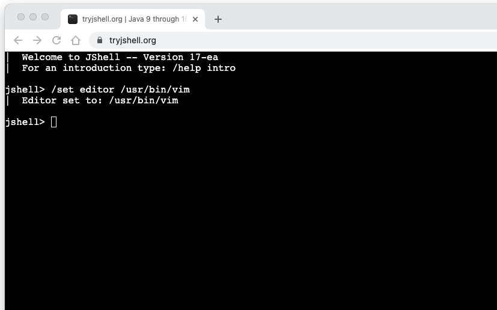

= tryjshell.org
Rahman Usta
:doctype: article
:encoding: utf-8
:lang: en
:toc: left
:numbered:
:description: tryjshell.org is a web terminal to test Java 9 and Java 10 features on JSHELL
:author: Rahman Usta
:keywords: web,terminal,java-9,java-10,jshell,tty,docker,cloud

== About

tryjshell.org is a web terminal to try and test Java 9 and Java 10 experimental features on the JShell tool.

//image::images/Image-310817-062349.305.png[width=900]

=== Run on Web

*Open:* https://tryjshell.org

=== Run on Docker

[source,bash]
----
docker run -it --rm -p 8080:8080 rahmanusta/tryjshell
----

== License

https://github.com/javaterminal/tryjshell/blob/master/LICENSE[MIT]